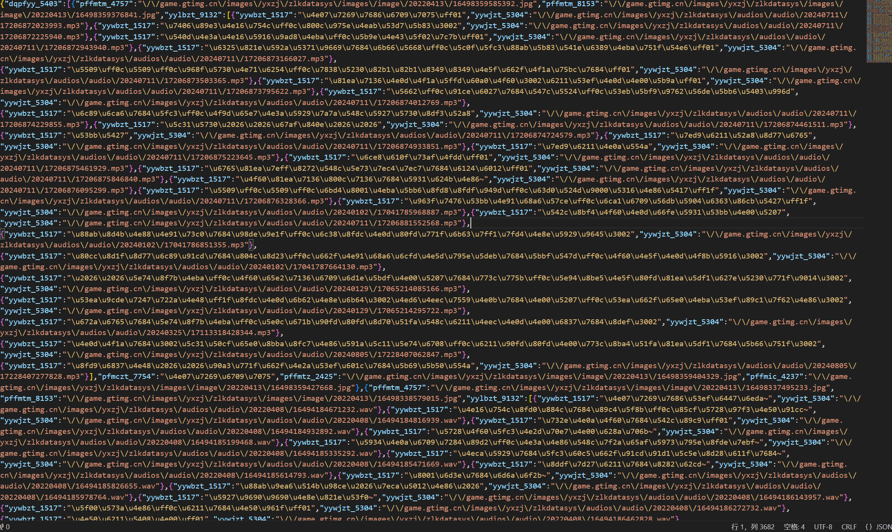
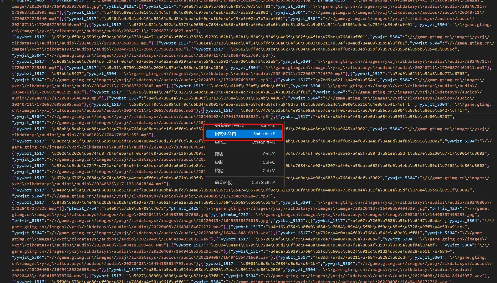
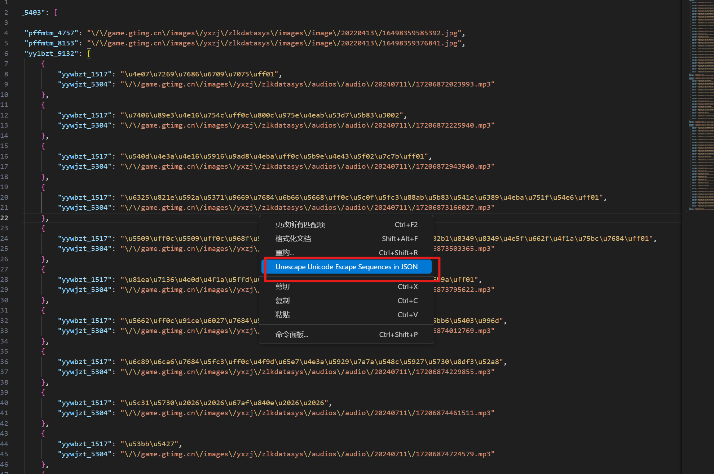
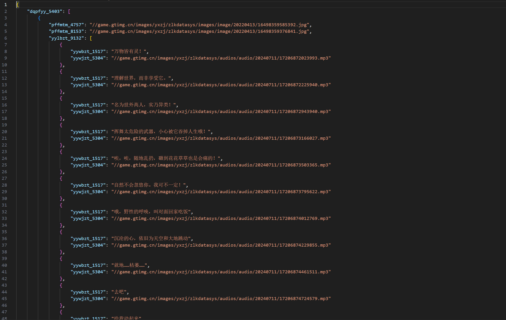

+++
author = "Lulaide"
title = "王者荣耀语音数据集获取过程"
date = "2024-09-13"
description = "爬取王者荣耀官网，获取王者荣耀所有英雄及皮肤的音频，并制作数据集"
tags = [
    "数据集"
]
categories = ["教程&文档"]
image = "image.png"
+++

## 项目地址

- [WZRY-audio](https://github.com/lulaide/WZRY-audio)
- Git
```bash
git clone https://github.com/lulaide/WZRY-audio
```

### 抓包 [王者荣耀官方网站](pvp.qq.com) 

1. **英雄列表接口**：`https://pvp.qq.com/zlkdatasys/yuzhouzhan/list/heroList.json`
   - 此接口返回的是王者荣耀中的英雄列表及其相关信息。
   
2. **语音接口**：`https://pvp.qq.com/zlkdatasys/yuzhouzhan/herovoice/yzzyxi_2602.json`
   - 该接口用于获取每个英雄的语音信息，`yzzyxi_2602` 代表英雄的唯一标识符。

### 分析处理
- 访问[语音接口](https://pvp.qq.com/zlkdatasys/yuzhouzhan/herovoice/{hero_id}.json)，获得如下响应


- 目前json响应看起来一片混乱，没有逻辑，右键`格式化文档`



- 可以看到中文Unicode码并没有转换，可以安装插件[JSON Unescaped Unicode](https://marketplace.visualstudio.com/items?itemName=sunaoka.json-unescaped-unicode)快速转码并格式化



- 最后获取数据所需要的内容清晰可见


- 根据结构分析可以得到

|**字段名**|**含义**|
|:---------|:-------|
|`yzzyxi_2602`|ID|
|`yzzyxm_4588`|姓名|
|`yzzyxc_4613`|皮肤|
|`yywbzt_1517`|语音文本|
|`yywjzt_5304`|语音链接|


### 编写程序

先从英雄列表获取所有英雄及皮肤的`ID`和`姓名`，再使用音频接口进行爬取。每发现一个英雄就创建其对应的文件夹，并在文件夹下生成其`皮肤`的文件夹，在文件夹中使用`语音链接`下载其语音，并在list文件中记录所下载的文件其对应的`语音文本`。


